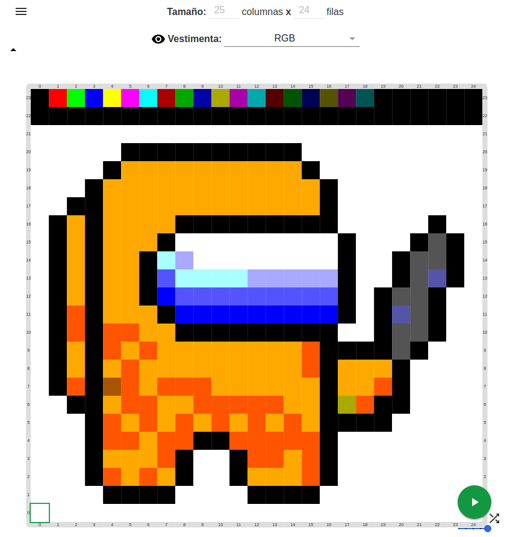

# Paint - Gobstones Project Builder

Utilidad para generar un proyecto de [Gobstones](https://gobstones.github.io/)
para desarrollar el proyecto "Paint": Un editor grafico con una paleta RGB.



El proyecto contiene 3 herramientas

## paint_project (principal)

Dentro de `paint`, ejecutar:

```bash
./build.sh
```

El script empaqueta:
 * la vestimenta (RGB.zip)
 * varios tableros iniciales, creados a partir de imagenes (listadas en `boards.txt`)
En un archivo `.gbp`, que es un *proyecto* de Gobstones. El contenido del mismo
esta en este workspace de Git, por lo que se pueden modificar algunos metadatos
(ej. libreria de comandos).

## img2board

Utilidad para convertir una imagen (JPG, PNG, etc) en un tablero inicial de
Gobstones.


Dentro de `palette_builder`, ejecutar:

```bash
python img2board.py <imagen_entrada> <tablero_salida.gbb>
```

El tablero (`.gbb`) creado como salida es un archivo de texto que se puede
cargar como *tablero inicial* en Gobstones.

Esta utilidad se usa desde el `paint_project`.

## palette_builder

Constuye una *vestimenta* de Gobstones para visualizar cantidades de bolitas
(Rojo, Verde, Azul) como un color usando el modelo RGB.

Dentro de `palette_builder`, ejecutar:

```bash
./build.sh
```

Esto genera varios PNGs para cada combinacion RGB de colores (por defecto
2 bits por pixes, es decir 64 colores con cada valor de RGB entre 0 y 3), y
los empaqueta en una "vestimenta" de Gobstones `RGB.zip`.
